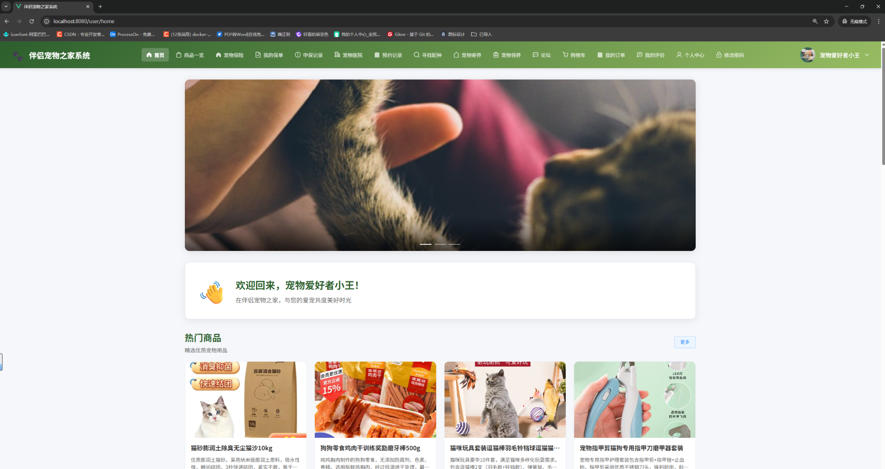
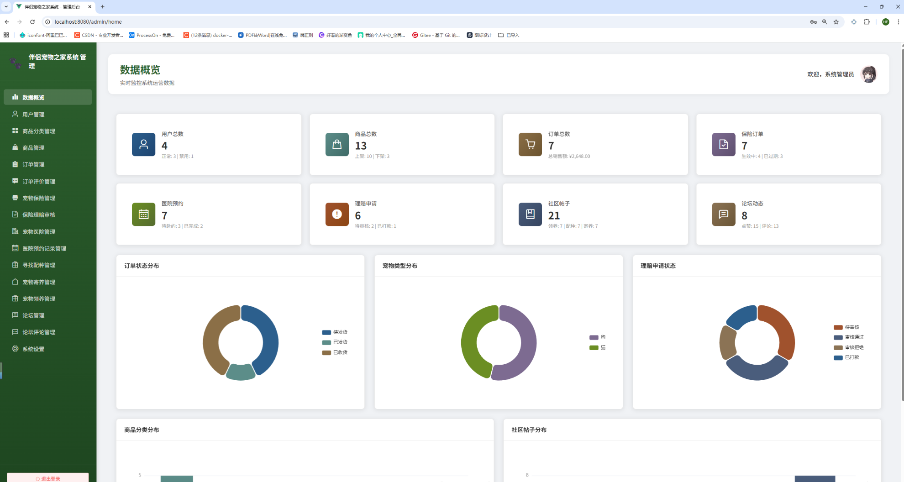
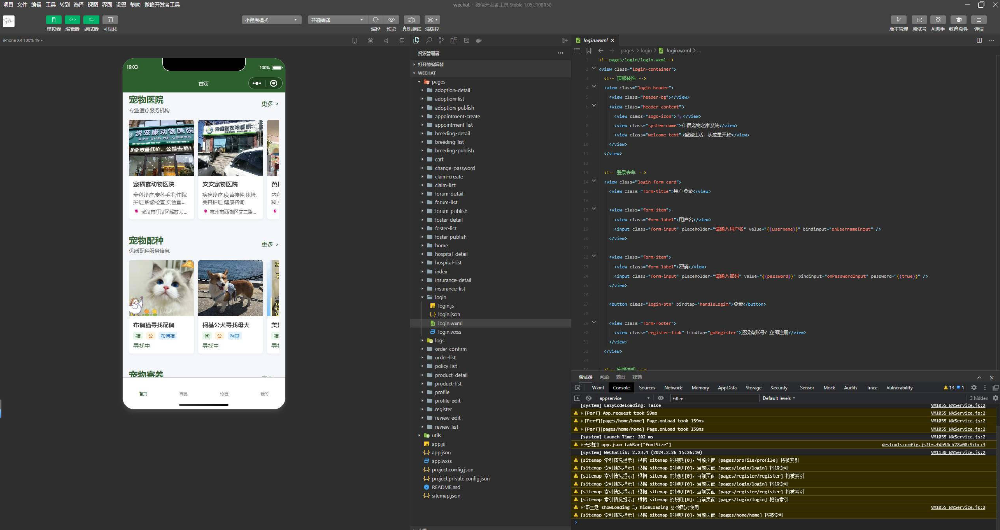

## 项目介绍

<p align=center>
  <a href="#" style="border-radius: 50%;width: 100px;height: 100px">
    
  </a>
</p>


<p align="center">
   <a target="_blank" href="https://github.com/your-github-username/pet-home-system">
      
      
      
      
      
      
      
   </a>
</p>


[在线地址](#在线地址) | [技术介绍](#技术介绍) | [功能描述](#功能描述) | [演示截图](#演示截图) | [目录结构](#目录结构) | [项目特点](#项目特点) | [联系博主](#联系博主)

---

## 在线体验地址  [在线体验系统](http://47.97.154.151:18000/login)

**项目演示地址**: [在线体验系统](http://47.97.154.151:18000/login)

**注意**: 测试账号请查看 `ddl.sql` 文件中的初始数据

---

## 技术介绍

### 后端技术栈

| 技术         | 说明           | 官网                                                         |
| ------------ | -------------- | ------------------------------------------------------------ |
| Spring Boot  | 容器 + MVC框架 | https://spring.io/projects/spring-boot                       |
| MyBatis-Plus | ORM框架        | https://baomidou.com                                         |
| MySQL        | 数据库         | https://www.mysql.com                                        |
| JWT          | JWT登录支持    | https://jwt.io                                               |
| Hutool       | Java工具类库   | https://hutool.cn                                            |
| POI          | Excel导入导出  | https://poi.apache.org                                       |
| WebSocket    | 实时通讯       | https://docs.spring.io/spring-framework/docs/current/reference/html/web.html#websocket |

### 前端技术栈

| 技术       | 说明       | 官网                       |
| ---------- | ---------- | -------------------------- |
| Vue        | 前端框架   | https://cn.vuejs.org       |
| Vue Router | 路由框架   | https://router.vuejs.org   |
| Axios      | HTTP框架   | https://axios-http.com     |
| Element UI | UI框架     | https://element.eleme.cn   |
| ECharts    | 数据可视化 | https://echarts.apache.org |

### 小程序技术栈

| 技术       | 说明       | 官网                                                       |
| ---------- | ---------- | ---------------------------------------------------------- |
| 微信小程序 | 小程序框架 | https://developers.weixin.qq.com/miniprogram/dev/framework |

---

## 功能描述

系统分为（身份）：普通用户、管理员。

**普通用户功能：**

1. 登录
2. 注册
3. 修改密码
4. 个人中心
5. 首页
6. 商品一览
7. 商品详情
8. 购物车
9. 我的订单
10. 我的评价
11. 宠物保险
12. 我的保单
13. 申保记录
14. 宠物医院
15. 预约记录
16. 寻找配种
17. 宠物寄养
18. 宠物领养
19. 论坛


**管理员功能：**

1. 登录
2. 数据概览
3. 用户管理
4. 商品分类管理
5. 商品管理
6. 订单管理
7. 订单评价管理
8. 宠物保险管理
9. 保险理赔审核
10. 宠物医院管理
11. 医院预约记录管理
12. 寻找配种管理
13. 宠物寄养管理
14. 宠物领养管理
15. 论坛管理
16. 论坛评论管理
17. 系统设置

---

## 演示截图 （仅展示部分，请在顶部在线体验）








---

## 目录结构

```
伴侣宠物之家系统/
├── back-end/                    # 后端项目
│   ├── src/
│   │   └── main/
│   │       ├── java/
│   │       │   └── com/notmaker/
│   │       │       ├── controller/      # 控制器层
│   │       │       ├── service/         # 服务层
│   │       │       ├── mapper/          # 数据访问层
│   │       │       ├── entity/          # 实体类
│   │       │       ├── config/          # 配置类
│   │       │       └── SpringBootStarter.java  # 启动类
│   │       └── resources/
│   │           └── application.yml      # 配置文件
│   ├── ddl.sql                  # 数据库建表脚本
│   └── pom.xml                  # Maven依赖配置
│
├── front-end/                   # 前端项目
│   ├── src/
│   │   ├── views/               # 页面
│   │   ├── router/              # 路由配置
│   │   ├── api/                 # 接口封装
│   │   ├── assets/              # 静态资源
│   │   ├── App.vue              # 根组件
│   │   └── main.js              # 入口文件
│   ├── public/
│   │   └── index.html
│   ├── package.json             # 依赖配置
│   └── vue.config.js            # Vue配置
│
├── wechat/                      # 微信小程序
│   ├── pages/                   # 小程序页面
│   ├── utils/                   # 工具类
│   ├── app.js                   # 小程序入口
│   ├── app.json                 # 小程序配置
│   └── app.wxss                 # 全局样式
│
└── readme.md                    # 项目说明文档
```

---

## 项目特点

### 功能特点

- **多端支持**: 提供Web端（管理员+用户）和微信小程序端
- **角色管理**: 支持管理员和普通用户两种角色
- **宠物领养**: 用户可发布领养信息，查看领养申请
- **宠物寄养**: 用户可发布寄养信息，预约寄养服务
- **宠物配种**: 用户可发布配种信息，查看配种详情
- **宠物医院**: 提供医院信息展示和预约功能
- **宠物保险**: 提供宠物保险购买和理赔服务
- **宠物商城**: 用户可购买宠物用品，管理订单
- **社区论坛**: 用户可发布帖子，评论交流
- **数据统计**: 管理员可查看可视化数据图表
- **系统配置**: 管理员可配置系统名称、轮播图等

### 技术特点

- **前后端分离**: 采用主流的前后端分离架构
- **响应式设计**: 适配多种屏幕尺寸
- **简洁易懂**: 代码结构清晰，注释详细，适合学习
- **开箱即用**: 提供完整的建表脚本和示例数据
- **规范统一**: 严格遵循开发规范，便于维护
- **现代UI**: 采用Element UI，界面简洁美观

### 设计特点

- **用户端**: 顶部导航栏，首页轮播图，卡片式布局
- **管理端**: 左侧导航栏，数据可视化，表格管理
- **小程序端**: 简洁流畅的移动端交互体验

---

## 运行环境

- **JDK**: 1.8+
- **MySQL**: 8.0+
- **Node.js**: 12.0+
- **Maven**: 3.0+

---

## 开发工具

- **后端**: IDEA / Eclipse
- **前端**: VSCode / WebStorm
- **数据库**: Navicat / MySQL Workbench
- **小程序**: 微信开发者工具

---

## 运行步骤

### 1. 数据库准备

```bash
# 创建数据库并导入表结构和数据
执行 back-end/ddl.sql 或 ddl.sql 文件
```

### 2. 后端启动

```bash
# 进入后端目录
cd back-end

# 修改数据库配置
编辑 src/main/resources/application.yml
修改数据库连接信息（url、username、password）

# 启动后端项目
运行 SpringBootStarter.java 主类

# 访问地址
http://localhost:18007
```

### 3. 前端启动

```bash
# 进入前端目录
cd front-end

# 安装依赖
npm install

# 启动前端项目
npm run serve

# 访问地址
http://localhost:8080
```

### 4. 小程序启动

```bash
# 使用微信开发者工具打开 wechat 目录
# 修改 utils/util.js 中的后端地址
# 编译运行
```

---

## 默认账号

| 角色     | 账号    | 密码   |
| -------- | ------- | ------ |
| 管理员   | admin   | 123456 |
| 普通用户 | user001 | 123456 |

---

## 许可证

本项目采用 Apache License 2.0 许可证

---

## 注意事项

1. 本项目为学习项目，代码注重简洁易懂
2. 请勿用于商业用途
3. 密码为明文存储，实际项目请使用加密方式
4. 首次运行请先创建文件上传目录（默认：D:\uploads\）
5. 数据库字符集建议使用 utf8mb4

---

## 联系博主

如有问题，欢迎提交 Issue 或 Pull Request
友好交流，请备注来源：
威X：167，6811，8056